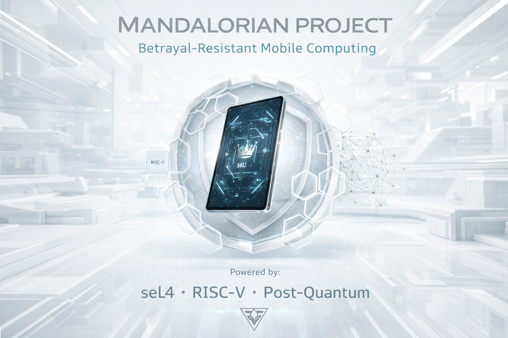
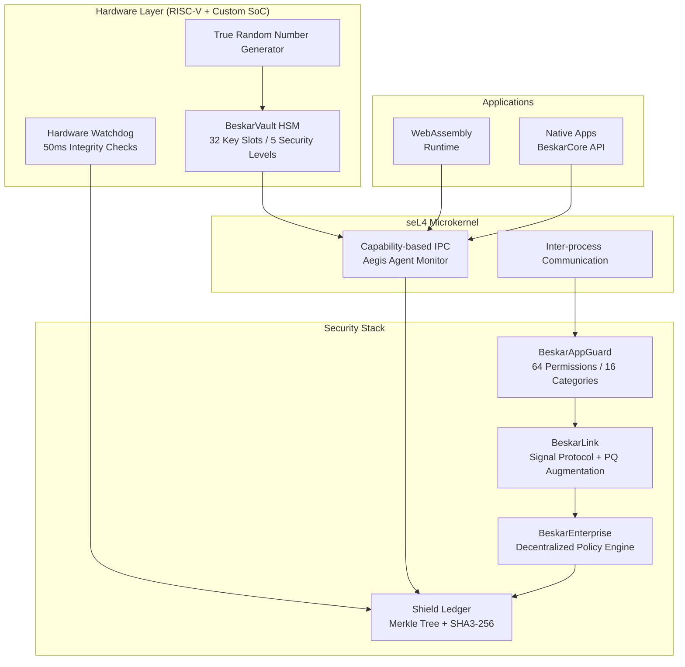

[](https://github.com/iamGodofall/mandalorian-project/actions/workflows/ci.yml)
[](tests/comprehensive/)
[](LICENSE)
[](https://github.com/seL4/seL4)
[](https://iamgodofall.github.io/mandalorian-project/)

---

# Mandalorian Project — Sovereign Mobile Computing

**Betrayal-Resistant Architecture Built on seL4 Microkernel**

> *"Sovereignty is not a feature — it is the foundation."*

The Mandalorian Project builds the world's first **betrayal-resistant mobile computing platform** — a system mathematically incapable of violating user trust, even under coercion, legal compulsion, or physical capture.

**Live documentation:** [https://iamgodofall.github.io/mandalorian-project/](https://iamgodofall.github.io/mandalorian-project/)

---

## The Problem

Conventional smartphones *claim* security while retaining backdoors for vendors, governments, and "lawful access." The Mandalorian Phone implements **provable sovereignty**:

- No entity — not even the manufacturer — can access user data without explicit, real-time consent
- All security decisions are cryptographically logged to an immutable Shield Ledger
- Hardware-enforced integrity checks operate continuously without network dependency
- Every line of code is reproducibly built and formally verified where it matters most

---

## Architecture



### Security Guarantees

| Guarantee | Implementation |
|---|---|
| **No backdoors** | Zero central servers; all policy enforced on-device via seL4 capabilities |
| **Key destruction on tamper** | 6 sensor types trigger immediate HSM key zeroization |
| **Forward secrecy** | Signal Protocol Double Ratchet — past messages safe even if keys compromised |
| **Post-quantum resistance** | CRYSTALS-Dilithium signatures on identity keys (Phase 3) |
| **Continuous integrity** | 50ms CRC32 checks + 1s SHA3-256 full verification via Continuous Guardian |
| **Immutable audit log** | Shield Ledger — Merkle tree of all security decisions, queryable offline |

---

## System Components

| Component | Name | Purpose | Status |
|-----------|------|---------|--------|
| **Device** | Mandalorian Phone | RISC-V-based sovereign mobile hardware | Dev: VisionFive 2 (JH7110) / Prod: Custom SoC (Phase 3) |
| **Core OS** | BeskarCore | seL4-based betrayal-resistant foundation | Phase 1 development |
| **Attestation** | Helm | Post-quantum sovereign attestation co-processor | Phase 2 (discrete HSM) |
| **Privacy Agent** | Aegis | IPC monitoring + consent enforcement | Integrated into BeskarCore |
| **Runtime** | WebAssembly | Cross-platform app execution (native-first) | Phase 1 |

---

## Hardware Reality Check

| Component | Production-Ready? | Notes |
|-----------|-------------------|-------|
| RISC-V smartphone SoC | No | VisionFive 2 is Linux SBC only — no cellular baseband, no secure enclave |
| OTP key fusing | No | Requires custom silicon (Phase 3) |
| Tamper mesh | No | Requires custom PCB (Phase 2) |
| Memory encryption | No | Custom silicon required (Phase 3) |

> VisionFive 2 is suitable **only for software development and architectural validation**. True betrayal resistance requires custom hardware.

---

## Getting Started

### Prerequisites

```bash
sudo apt install libsodium-dev cmake pkg-config
```

### Mandalorian Core (Production-Ready)

```bash
cd mandalorian
make
./constrained-agent-demo   # Tests 10 gate steps
```

### BeskarCore

```bash
git clone https://github.com/iamGodofall/mandalorian-project.git
cd mandalorian-project/beskarcore
make deps
make simulate
make run_simulate
```

### Run Security Demos

```bash
cd beskarcore

make demo
./demo_continuous_guardian   # Continuous Guardian demonstration
./demo_beskar_vault          # HSM key lifecycle demonstration
./demo_beskar_link           # Secure messaging demonstration
./demo_beskar_enterprise     # Decentralized policy demonstration
./demo                       # Main functional demo (SHA3-256 + Merkle ledger)
```

---

## Documentation

Full documentation is live at **https://iamGodofall.github.io/mandalorian-project/**

| Section | Contents |
|---------|----------|
| [Architecture](https://iamgodofall.github.io/mandalorian-project/architecture/overview/) | Gate, Helm, Vault, Link, Shield Ledger |
| [Security](https://iamgodofall.github.io/mandalorian-project/security/) | Audit findings, critical fixes, bypass resistance |
| [API Reference](https://iamgodofall.github.io/mandalorian-project/api/) | Full API documentation |
| [FOSDEM 2026 Talk](https://iamgodofall.github.io/mandalorian-project/fosdem2026_talk_outline/) | Presentation outline and abstract |

---

## Licensing

| Tier | License | Price | Best For |
|------|---------|-------|----------|
| **Open Source** | Mandalorian Sovereignty License | Free | Individuals, researchers |
| **Startup** | Commercial | $10,000/year | Pre-revenue startups |
| **Growth** | Commercial | $50,000/year | Growing companies |
| **Enterprise** | Commercial | $250,000/year | Large enterprises |
| **Government/Defense** | Commercial | $500K–$2M+ | Defense, intelligence |

The core technology remains open and auditable. [See full license details.](COMMERCIAL_LICENSE.md)

---

## Contributing

All crypto code must pass **Dudect timing analysis** before merge. All security-critical code requires **ACSL annotations** for Frama-C verification. All builds must be **reproducible** bit-for-bit. Any PR introducing backdoor mechanisms is rejected immediately.

[See full contributing guidelines.](CONTRIBUTING.md)

---

## Acknowledgments

- [seL4](https://github.com/seL4/seL4) — formally verified microkernel foundation
- [Signal Protocol](https://signal.org/docs/) — Double Ratchet + X3DH E2EE messaging
- [HACL* ](https://hacl-star.github.io/)— formally verified constant-time cryptography
- [OpenTitan](https://github.com/lowRISC/opentitan) — transparent silicon design principles

---

*Last updated: March 24, 2026*  
*Repository: [https://github.com/iamGodofall/mandalorian-project](https://github.com/iamGodofall/mandalorian-project)*  
*Documentation: [https://iamgodofall.github.io/mandalorian-project/](https://iamgodofall.github.io/mandalorian-project/)*  
*Contact: info@socialfeed.co.za or landinwest@gmail.com*
