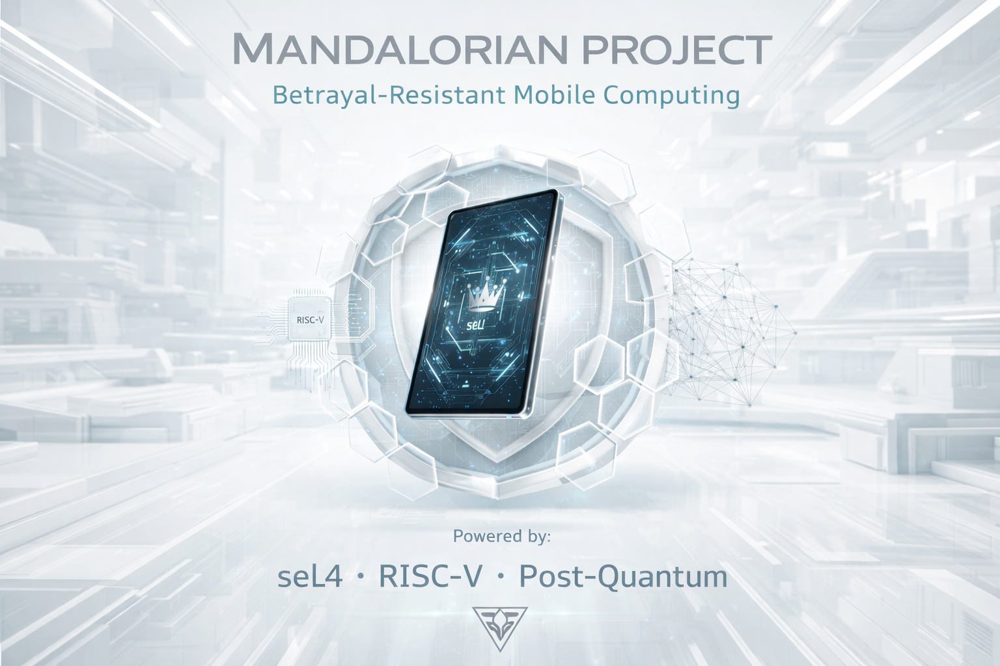
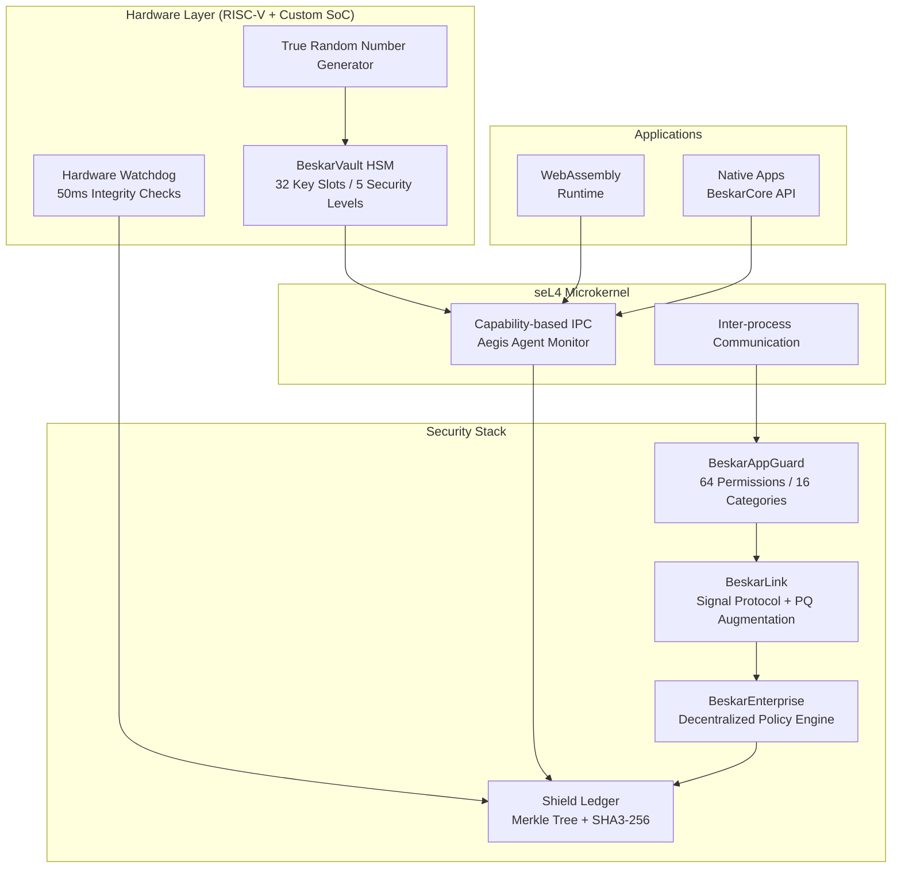

[](https://github.com/iamGodofall/mandalorian-project/actions/workflows/ci.yml)
[](LICENSE)
[](https://github.com/seL4/seL4)
[](https://iamgodofall.github.io/mandalorian-project/)

---

# Mandalorian Project — Sovereign Mobile Computing

**Betrayal-Resistant Architecture Built on seL4 Microkernel**

> *"Sovereignty is not a feature — it is the foundation."*

The Mandalorian Project builds the world's first **betrayal-resistant mobile computing platform** — a system mathematically incapable of violating user trust, even under coercion, legal compulsion, or physical capture.

**Live documentation:** [https://iamgodofall.github.io/mandalorian-project/](https://iamgodofall.github.io/mandalorian-project/)

---

## The Problem

Conventional smartphones *claim* security while retaining backdoors for vendors, governments, and "lawful access." The Mandalorian Phone implements **provable sovereignty**:

- No entity — not even the manufacturer — can access user data without explicit, real-time consent
- All security decisions are cryptographically logged to an immutable Shield Ledger
- Hardware-enforced integrity checks operate continuously without network dependency
- Every line of code is reproducibly built and formally verified where it matters most

---

## Architecture


```mermaid
graph TB
    subgraph Hardware["Hardware Layer (RISC-V + Custom SoC)"]
        HSM["BeskarVault HSM<br/>32 Key Slots / 5 Security Levels"]
        WDT["Hardware Watchdog<br/>50ms Integrity Checks"]
        TRNG["True Random Number Generator"]
    end

    subgraph Kernel["seL4 Microkernel"]
        CAP["Capability-based IPC<br/>Aegis Agent Monitor"]
        Ipc["Inter-process Communication"]
    end

    subgraph Security["Security Stack"]
        GL["Shield Ledger<br/>Merkle Tree + SHA3-256"]
        AG["BeskarAppGuard<br/>64 Permissions / 16 Categories"]
        BL["BeskarLink<br/>Signal Protocol + PQ Augmentation"]
        BE["BeskarEnterprise<br/>Decentralized Policy Engine"]
    end

    subgraph Apps["Applications"]
        WA["WebAssembly<br/>Runtime"]
        NA["Native Apps<br/>BeskarCore API"]
    end

    HSM --> CAP
    WDT --> GL
    TRNG --> HSM
    CAP --> GL
    Ipc --> AG
    AG --> BL
    BL --> BE
    BE --> GL
    WA --> CAP
    NA --> CAP
```

### Security Guarantees

These are design goals. The right-hand column says what the code in this
repository does *today*, which is not the same thing — see the status column
before relying on any row.

| Goal | Status | What is actually implemented |
|---|---|---|
| **No backdoors** | Design | No central servers and no remote-access path exists in the code. On-device enforcement via seL4 capabilities is architectural; the gate runs on the host today. |
| **Capability enforcement** | Working | Nine-step gate with HMAC-SHA3-256 capability authentication, wildcard resource matching with traversal rejection, size constraints, policy, and a receipt for every decision including denials. Covered by `tests/unit/test_gate_enforcement.c`. |
| **App attestation** | Partial | Helm challenges an app with a CSPRNG nonce it records; the app answers with HMAC-SHA3-256 over that challenge and its own app id. Wrong secret, zeroed tag, replayed challenge, self-chosen challenge, stale or future-dated challenge, and revoked app are each refused, in constant time — see `tests/unit/test_helm_attestation.c`. **Symmetric, so not a signature:** Helm holds the same secret and can therefore forge any app's response. It is *not* the CRYSTALS-Dilithium attestation this project long described; there is no Dilithium here. Until recently `helm_verify_attestation()` hardcoded its verdict to valid and accepted an all-zero tag from any registered app. |
| **Immutable audit log** | Working | Shield Ledger chains each entry into the previous root with SHA3-256. Append-only in memory; there is no on-disk or replicated store yet. |
| **Hash integrity** | Working | SHA3-256/512 pass the FIPS 202 known-answer vectors (`tests/unit/test_sha3_vectors.c`) and match an independent implementation across every length up to several blocks. SHA-512 (FIPS 180-4) is present for Ed25519 only, cross-checked against Python's `hashlib` at every length from 0 to 600 bytes. |
| **Signature verification** | Working (verify only) | Ed25519 (RFC 8032) in `beskarcore/src/ed25519.c`. Accepts the RFC 8032 §7.1 vectors and signatures produced by OpenSSL 3.0.13; rejects tampered messages, tampered signatures, wrong keys, non-canonical public keys and non-canonically-reduced S (signature malleability). The curve constants are derived from their definitions rather than transcribed, and `[L]B == identity` is asserted so a mistyped group order fails the suite. **There is no signing here** — that needs a constant-time implementation, and this one is deliberately variable-time because verification handles only public data. What this replaces: an `ed25519_verify()` that returned success for every input, including an all-zero signature, above ~680 lines of field arithmetic that had never run and was wrong at every level. |
| **Key destruction on tamper** | Not implemented | Requires the tamper mesh and custom PCB described under Hardware Reality Check. |
| **Secret hygiene** | Partial | Key material is wiped with `secure_zero()`, which the compiler cannot optimise away, including on app-secret revocation. Keys still live in ordinary application RAM — a real HSM never exposes them, which needs the hardware in Phase 2. |
| **Vault authentication** | Partial | `vault_mac()` / `vault_verify_mac()` are HMAC-SHA3-256 over a key slot, compared in constant time. They were `vault_sign()` / `vault_verify()` and documented as "Ed25519-style signature": verification recomputed the value from the *private* key, so it was a MAC all along and anyone able to verify was able to forge. Both also sized a stack buffer from the caller's message length. There is still no signature scheme in the vault. |
| **Forward secrecy** | Partial | The symmetric chain ratchet advances per message, so a captured chain key does not recover earlier message keys. The **DH ratchet and X3DH are not implemented** — `x3dh_key_agreement()` returns random bytes rather than performing any Diffie-Hellman — so there is no break-in recovery and this is *not* the Signal Double Ratchet. |
| **Message encryption** | Placeholder | BeskarLink uses a SHA3-based keystream with a SHA3 MAC, not a reviewed AEAD. Do not use it to protect real messages. |
| **Post-quantum resistance** | Not implemented | No ML-KEM (FIPS 203), ML-DSA (FIPS 204), SLH-DSA (FIPS 205) or any PQC primitive exists in this repository. Signatures are Ed25519, which a cryptographically relevant quantum computer breaks. Helm's attestation types were named and sized for Dilithium — a 1952-byte "public key", a 3293-byte "signature" — while implementing none of it; they are now named for the HMAC they actually carry. See *Post-quantum: where this actually stands*. |
| **Continuous integrity** | Working (simulated) | 50ms CRC32 with periodic SHA3-256 full verification. Measures simulated regions; there is no hardware watchdog behind it. |
| **Random number generation** | Working | All key, nonce and identifier material comes from the OS CSPRNG (`getrandom(2)`, `arc4random_buf`, `BCryptGenRandom`, or `/dev/urandom`) via `secure_random.h`, which **fails closed** — no entropy source means an error, never a weak fallback. Covered by `tests/unit/test_secure_random.c`, which fails against the previous clock-seeded implementation. |


---

## Post-quantum: where this actually stands

**The names this file used were the competition names, and in a project whose
licence condition 4 requires accurate documentation of security limitations that
matters.** CRYSTALS-Dilithium and CRYSTALS-Kyber were standardised in **August
2024** under different names:

| standard | algorithm | was called |
|---|---|---|
| **FIPS 203** | ML-KEM — key encapsulation | CRYSTALS-Kyber |
| **FIPS 204** | ML-DSA — digital signature | CRYSTALS-Dilithium |
| **FIPS 205** | SLH-DSA — stateless hash-based signature | SPHINCS+ |

**HQC** was selected in 2025 as a backup KEM built on different mathematics from
ML-KEM, and Falcon remains in standardisation. So "no Dilithium" is still true
and is no longer the way to say it.

### What this tree actually has

Ed25519, verify-only, written for auditability and checked against RFC 8032
vectors and against OpenSSL in CI. That is a *classical* signature scheme: a
cryptographically relevant quantum computer breaks it. Nothing here is
quantum-resistant and nothing here claims to be.

### If PQC is added, it is NOT hand-written here

That is this repository's own rule turned on its hardest case. Every crypto bug
found in this tree produced plausible-looking output: a rate-200 sponge that
returned 32 convincing bytes with no capacity at all, an "HMAC" that copied the
key into the output, and **680 lines of Curve25519 field arithmetic that was
wrong at every level underneath a `return 0`**. Ed25519 was repairable by hand
only because it can be checked line by line against a few lines of Python and
against published vectors.

ML-DSA is not that. It is rejection sampling, NTT arithmetic and hint
compression, with timing-attack surface throughout, and there is no short
independent implementation to diff against. Hand-rolling it would repeat this
project's most expensive mistake at a scale where inspection could not catch it.

**So the path is a reviewed implementation** — PQClean or liboqs — behind the
same auditable interface `ed25519.h` already sets, with the FIPS known-answer
vectors in `tests/unit/` and a cross-check against an independent implementation
in CI, exactly as SHA-512 is checked against Python's `hashlib` today.

**The real cost is the dependency, and it belongs in the decision rather than in
the footnotes.** This tree has none today, which is part of why it can be
audited at all. Taking one on is a trade to make deliberately.

---

## System Components

| Component | Name | Purpose | Status |
|-----------|------|---------|--------|
| **Device** | Mandalorian Phone | RISC-V-based sovereign mobile hardware | Dev: VisionFive 2 (JH7110) / Prod: Custom SoC (Phase 3) |
| **Core OS** | BeskarCore | seL4-based betrayal-resistant foundation | Phase 1 development |
| **Attestation** | Helm | Post-quantum sovereign attestation co-processor | Phase 2 (discrete HSM) |
| **Privacy Agent** | Aegis | IPC monitoring + consent enforcement | Integrated into BeskarCore |
| **Runtime** | WebAssembly | Cross-platform app execution (native-first) | Phase 1 |

---

## Hardware Reality Check

| Component | Production-Ready? | Notes |
|-----------|-------------------|-------|
| RISC-V smartphone SoC | No | VisionFive 2 is Linux SBC only — no cellular baseband, no secure enclave |
| OTP key fusing | No | Requires custom silicon (Phase 3) |
| Tamper mesh | No | Requires custom PCB (Phase 2) |
| Memory encryption | No | Custom silicon required (Phase 3) |

> VisionFive 2 is suitable **only for software development and architectural validation**. True betrayal resistance requires custom hardware.

---

## Getting Started

### Prerequisites

```bash
sudo apt install build-essential cmake
```

### Build and test

The host build covers BeskarCore, Helm, Aegis, VeridianOS and the Mandalorian
gate, with their demos and tests. It needs only a C compiler and CMake — there
is no libsodium or cmocka dependency for the default build.

```bash
git clone --recurse-submodules https://github.com/iamGodofall/mandalorian-project.git
cd mandalorian-project
cmake -B build -DCMAKE_BUILD_TYPE=Release
cmake --build build --parallel
ctest --test-dir build --output-on-failure
```

To build with AddressSanitizer and UBSan:

```bash
cmake -B build-asan -DCMAKE_BUILD_TYPE=Debug -DENABLE_SANITIZERS=ON
cmake --build build-asan --parallel
ctest --test-dir build-asan --output-on-failure
```

### Run the demos

```bash
./build/mandalorian/constrained-agent-demo   # gate enforcement, nine steps
./build/beskarcore/demo                      # SHA3-256 + Merkle ledger
./build/beskarcore/demo_continuous_guardian  # Continuous Guardian
./build/beskarcore/demo_beskar_vault         # HSM key lifecycle
./build/beskarcore/demo_beskar_link          # secure messaging
./build/beskarcore/demo_beskar_enterprise    # decentralised policy
./build/helm/demo_helm                       # attestation
```

### Target build (seL4 + CAmkES)

The RISC-V/seL4 image is built separately and needs the seL4 toolchain:

```bash
cd beskarcore
make deps
make simulate
make run_simulate
```

---

## Documentation

Full documentation is live at **https://iamGodofall.github.io/mandalorian-project/**

| Section | Contents |
|---------|----------|
| [Architecture](https://iamgodofall.github.io/mandalorian-project/architecture/overview/) | Gate, Helm, Vault, Link, Shield Ledger |
| [Security](https://iamgodofall.github.io/mandalorian-project/security/) | Audit findings, critical fixes, bypass resistance |
| [API Reference](https://iamgodofall.github.io/mandalorian-project/api/) | Full API documentation |
| [FOSDEM 2026 Talk](https://iamgodofall.github.io/mandalorian-project/fosdem2026_talk_outline/) | Presentation outline and abstract |

---

## Licensing

| Tier | License | Price | Best For |
|------|---------|-------|----------|
| **Open Source** | Mandalorian Sovereignty License | Free | Individuals, researchers |
| **Startup** | Commercial | $10,000/year | Pre-revenue startups |
| **Growth** | Commercial | $50,000/year | Growing companies |
| **Enterprise** | Commercial | $250,000/year | Large enterprises |
| **Government/Defense** | Commercial | $500K–$2M+ | Defense, intelligence |

The core technology remains open and auditable. [See full license details.](COMMERCIAL_LICENSE.md)

---

## Contributing

All crypto code must pass **Dudect timing analysis** before merge. All security-critical code requires **ACSL annotations** for Frama-C verification. All builds must be **reproducible** bit-for-bit. Any PR introducing backdoor mechanisms is rejected immediately.

[See full contributing guidelines.](CONTRIBUTING.md)

---

## Acknowledgments

- [seL4](https://github.com/seL4/seL4) — formally verified microkernel foundation
- [Signal Protocol](https://signal.org/docs/) — Double Ratchet + X3DH E2EE messaging
- [HACL* ](https://hacl-star.github.io/)— formally verified constant-time cryptography
- [OpenTitan](https://github.com/lowRISC/opentitan) — transparent silicon design principles

---

*Last updated: March 24, 2026*  
*Repository: [https://github.com/iamGodofall/mandalorian-project](https://github.com/iamGodofall/mandalorian-project)*  
*Documentation: [https://iamgodofall.github.io/mandalorian-project/](https://iamgodofall.github.io/mandalorian-project/)*  
*Contact: info@socialfeed.co.za or landinwest@gmail.com*
